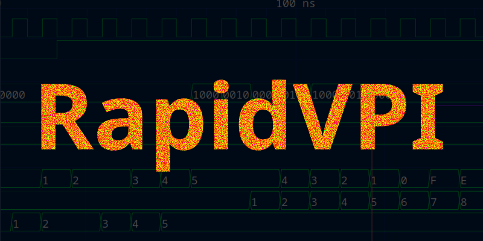
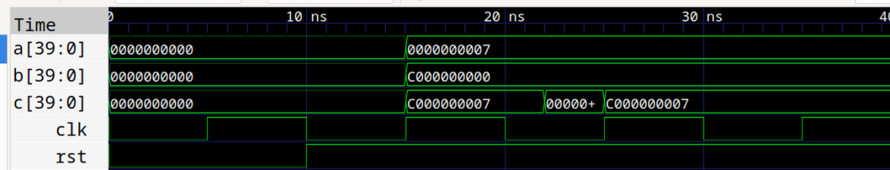

# RapidVPI
Blazingly fast, modern C++ API using coroutines for efficient RTL verification and co-simulation via the VPI interface.
### Introduction

The RapidVPI API allows you to write modern C++ code for verification and co-simulation of digital RTL HDL designs using any simulator which supports VPI interface. Currently, as of now this library was tested with Iverilog. The API abstracts many of the VPI related boilerplate and tedious mechanisms and implements all the necessary signal driving and reading via the convenient coroutine mechanism native to C++ since version 20. User just creates the coroutine awaitable object, adds operations to it such as read, write and suspends it with co_await statement.

### Why RapidVPI?
The motivation for the development of this library was the ability to use all the flexible and advanced features of modern C++ during the RTL verification or co-simulation since verification itself is a software task and should use the proper software design tool such as C++; SystemVerilog is not a tool which is as powerful as C++ when it comes to modeling some advanced complex system. Additionally, SystemVerilog running with all of its features requires a very expensive license for the EDA tools, such a basic feature as randomization of variables in a class for example is not supported even in a lower tier paid simulators. The VPI interface on the other hand is supported by most lowest tier packaged commercial simulators, and of course it is supported by Iverilog which is a free and fast tool for Verilog simulation.

### Installation


### What does writing RapidVPI test code look like?
For example, in a below code fragment we are looking at scenario of some module's simulation start. What we do is, set all inputs to zero by default, then after 10 ns we release the reset. Then we show forcing port "c" of DUT to some value and releasing that force 2 ns after. In order to get that job done we have a run() coroutine declared and its implementation shown in the code.

In this current example we are writing values to DUT ports. In order to write a value one first creates a writer awaitable object using the getCoWrite(), the argument to getCoWrite is basically a delay (by default in nanoseconds) from the current timeline to when the write of all the signals should occur. Once that event occurs, the code proceeds below the line `co_await awaiter`, after that all the scheduled write events get automatically cleared for the `awaiter` object (which by the way can have any name). 

Then, since `awaiter` was already declared we can just keep reusing it, for example modify its delay with `awater.setDelay(10)` line, now the delay is 10 nanoseconds from the current timeline (from the timeline which is completed as per previous request, when the delay was 0 ns). Next, we add new write operation, this time port "rst" has to be written with value 1. Then we again schedule the write and further code execution blocked until write happens.

Force and release operations also belong to the write group, thus also carried out in a similar fashion as shown in snippet below.

The run() coroutine shown below is just example of some single user defined RunTask coroutine, however; user can have as many as he wants such coroutines executing concurrently.

```c++
  TestImpl2::RunTask TestImpl2::run() {
    auto awaiter = test.getCoWrite(0); // Create awaitable object for write operations with given delay
    awaiter.write("clk", 0); // Start adding the write operations to any signals of DUT
    awaiter.write("a", 0); // Currently setting ports clk,rst,a,b of DUT to 0
    awaiter.write("b", 0);
    awaiter.write("rst", 0);
    co_await awaiter; // Schedule events and suspend coroutine

    awaiter.setDelay(10); // Modify now delay for the previously created awaiter object
    awaiter.write("rst", 1); // Schedule another write of value 1 to rst port of DUT
    co_await awaiter;

    auto await_force = test.getCoWrite(12); // Create new awaitable object for writing
    await_force.force("c", 0xabcd); // This time force signal to certain value 12 ns from current time
    co_await await_force;

    auto await_release = test.getCoWrite(2); // Create a new awaitable object
    await_release.release("c"); // Release the forcing for that signal 2 ns after
    co_await await_release;

    co_return;
  }
  ```
Every time you obtain an awaitable object using getCoWrite(timedelay), the timedelay is in nanoseconds by default, however; if different time unit required one can use templated arguments and do it like:
```c++
auto awaiter = test.getCoWrite<ms>(0); // valid units are: ms, us, ns, ps
```

Another example now for reading is below. We want to read value of "c" port of DUT at current value (without delay, thus 0). We create awaitable object obtained from getCoRead, we schedule read operation for port "c", we suspend coroutine with `co_await`. Once the read is done, the value is internally stored in `awRd` and we can obtain it in several ways, a hex string, a binary string or just numeric value (if it is 64 bits or less).

```c++
    auto awRd = test.getCoRead(0);
    awRd.read("c"); // this will create placeholder of key,value pair for read "c"
    co_await awRd;
    std::string value_hex = awRd.getHexStr("c"); // Expecting hex output
    std::string value_bin = awRd.getBinStr("c"); // Binary output
    printf("numeric value of 'c' is: %llx\n", awRd.getNum("c"));
    printf("hex string is: %s\n", value_hex.c_str());
    printf("bin string is: %s\n", value_bin.c_str());
```

Our printout would look like:
```
[build] numeric value of 'c' is: c000000007
[build] hex string is: C000000007
[build] bin string is: 0000000000000000000000001100000000000000000000000000000000000111
```

Let's look at another example of waitinf for some port/signal value to change or waiting for a cahnge of port to specific value.
```c++
    auto awchange = test.getCoChange("clk", 1); // get next clk rising change
    co_await awchange;
```
In above example, we are waiting for a change of port "clk" to be logic 1. This is convenient for a case when you for example want to start scheduling some operations (write or read) on the rising edge of some clock. Above code could also be a oneliner:
```c++
co_await test.getCoChange("clk", 1); // wait for next clk edge
```
The above code will unblock only after the change of "clk" to rising edge occurs.

The next example is also related to waiting of change for a signal, however; this time we are looking for any change, not change to specific value. Let's imagine that at some simulation start we want to monitor port "c" for any change and then if change occured we want to print the value of that change. The below code shows how to do it.

We again declare the awaitable object for change type using getCoChange(), and in the argument of that function we put the port name of DUT, which is "c". After that we suspend coroutine using `co_await`. You might notice that for some reason we doing it twice, the reason is that first "change" is right at the very start of simulation to whatever the default value it is. Then we have to schedule and suspend it again for a real change (caused by our other stimuli inputs to DUT).

After the suspension, once the internal scheduler of RapidVPI wakes up the coroutine and `co_await` line unblocks again we print the value of the `awchange` object related to "c" port of DUT. If we needed to get another change of same port "c" we would put another `co_await awchange` line (no need to re-declare the new awaitable again).
```c++
  TestImpl::RunTask TestImpl::run3() {
    auto awchange = test.getCoChange("c");
    co_await awchange; // First change on simulation start
    co_await awchange; // Change which we expecting

    printf("Awaited Numeric value for the 'c' is : %llx\n", awchange.getNum());
    printf("Awaited Hex String value for the 'c' is : %s\n", awchange.getHexStr().c_str());
    printf("Awaited Bin String value for the 'c' is : %s\n", awchange.getBinStr().c_str());

    co_return;
  }
```

### RapidVPI internal architecture
The RapidVPI has its internal scheduling engine which interacts simulator thru the VPI interface. When user declares his RunTask type test coroutines and inside them declares the awaitable objects and adds actions to those objects such as write and read, the internal engine puts those actions into the special queue for that specific awaitable object. 

Once user emits the `co_await` the coroutine gets suspended and the actions entered automatically under the hood of RapidVPI into the queue get scheduled with simulator through the VPI interface using the `vpi_register_cb()` VPI function. After that the simulator performs whe queued actions, whether it is read or write, the special internal callback function within RapidVPI is called and that callback function resumes the coroutine, thus unblocking the line `co_await awaitable`. This all happens internally and user does not need to worry about or know those details. Neither user has to know about mechanics of VPI related functions such as `vpi_register_cb()` or `vpi_put_value()`, since all of that is enclosed in the inner workings of RapidVPI.

The internal test manager under the hood of RapidVPI manages the multiple tests which user can create as many as needed and run them concurrently.

User also does not need to worry about the race conditions between writing values to say "a" and "b" and reading result from "c" which depends on "a" and "b" since internally, the RapidVPI employs always the `cbReadOnlySynch` flag for VPI for reading the values which ensures that all the latest updates at the end of cycle will be done before fetching a read.

User just has to maintain certain very minimalistic boiler plate and code structure when creating his tests as explained in next section.

### Organization of RapidVPI test code
Now let's take a closer, more detailed look at some example. In this case, let the example be simple. Assume that our RTL is just a clocked adder with the following SystemVerilog code:
```verilog
`default_nettype none `timescale 1 ns / 1 ps

module dut_top #(
    parameter integer WIDTH = 40
) (
    input wire clk,
    input wire rst,
    input wire [WIDTH-1:0] a,
    input wire [WIDTH-1:0] b,
    output logic [WIDTH-1:0] c
);

  always_ff @(posedge clk, rst) begin
    if (!rst) begin
      c <= 0;
    end else begin
      c <= a + b;
    end
  end


endmodule
```

So basically, we just have a 40 bit input ports "a" and "b", and the 40 bit output port "c", we do have reset input and clock input. On every clock edge the sum of "a" and "b" is computed and sent out to output port "c". 

What we will be doing is basically putting all inputs to 0 at start of simulation, including the active low reset, then after 10 ns we will lift the reset off, and start putting values to "a" and "b" and checking them in "c", we will also play with forcing port "c" to some arbitrary value.

First things first, lets look at the tree of the vip_template software verification project:
```
.
├── CMakeLists.txt
└── src
    └── test
        ├── modules
        │   ├── test_impl2
        │   │   ├── CMakeLists.txt
        │   │   ├── test_impl2.cpp
        │   │   └── test_impl2.hpp
        │   ├── test_impl.cpp
        │   └── test_impl.hpp
        ├── test.cpp
        └── test.hpp
```
The tree is organized in such a way that first there is main CMake file at the root of the tree, then there is ./src folder where all the source is located. Under the ./src folder the main first files are test.hpp where the main Test class is defined (based on the TestBase of RapidVPI), then there is test.cpp where user defines his IO ports of DUT. We next have our test implementation files, specifically for test_impl1 module with its associated .hpp and .cpp files.

After that there is ./modules folder which basically holds various test modules, some test modules have just one .hpp and one .cpp file like the module test_impl, others could have more .cpp files and for clean architecture can be included in their own subfolders, just like in this example it is shown that test_impl2 actually has its own subfolder. 

The test.hpp file is where all test implementations are declared in the main test class.

It is important to maintain the nice and tidy organization for the project in order to run any large test and keeping things organized, as well as maintaining proper boilerplate for RapidVPI project. Although, user can reorganize things later down the road as he sees fit.

Every time user starts his own software verification or co-simulation project, he can basically copy the ./vip_template and easily fit it to his needs while reusing the static portions of its boilerplate.

First thing to notice is, CMake is actively used to build this project, which makes sense since it is C++ project. So the main file under ./vip_template you see is CmakeLists.txt file, lets look at it and see what would we need to change when creating a new project based on vip_template:
```cmake
cmake_minimum_required(VERSION 3.10)

# Set the project and target name
set(PROJECT_NAME vip_template)
project(${PROJECT_NAME} VERSION 0.0.1)

# Set the C++ standard
set(CMAKE_CXX_STANDARD 23)

# Set the VPI include path (e.g., from Icarus Verilog, or another simulator)
set(vpi_include_dir $ENV{VPI_INCLUDE_DIR} CACHE PATH "Path to the VPI include directory")

# Ensure the variable is set
if (NOT vpi_include_dir)
    message(FATAL_ERROR "VPI_INCLUDE_DIR environment variable must be set or provided manually.")
endif()

# Set the path where rapidvpiConfig.cmake is located
set(CMAKE_PREFIX_PATH "/usr/local/lib/cmake/rapidvpi")

# Find the rapidvpi library (rapidvpi) using find_package
find_package(rapidvpi REQUIRED)

# Add user's test files (from the src/test and src/test/modules directories)
set(TEST_SOURCES
        src/test/test.cpp
        src/test/modules/test_impl.cpp
)

# Create the shared library using the project name (ONLY user's test code)
add_library(${PROJECT_NAME} SHARED ${TEST_SOURCES})

# Specify include directories (for user's test folder, and VPI headers)
target_include_directories(${PROJECT_NAME} PRIVATE
        /usr/local/include/rapidvpi/core
        /usr/local/include/rapidvpi/scheduler
        /usr/local/include/rapidvpi/testbase
        /usr/local/include/rapidvpi/testmanager
        src/test  # User's test folder
        src/test/modules  # User's test modules folder
        ${vpi_include_dir}  # Path to the VPI headers (e.g., from Icarus Verilog)
)

# Add the subdirectory for test_impl2, which has its own CMakeLists.txt
add_subdirectory(src/test/modules/test_impl2)

# Link against the imported target from the rapidvpi library
target_link_libraries(${PROJECT_NAME} PRIVATE rapidvpi::rapidvpi.vpi)

# Add VPI library for simulation
target_link_libraries(${PROJECT_NAME} PRIVATE vpi)
```

The first line which user would modify for hiw own fit is for setting project name:
```cmake
set(PROJECT_NAME vip_template)
```
In this case project name for verification is `vip_template`. Next thing to be possibly changed when creating new project is addition of .cpp source files to the first test implementation, in this case test_impl. As you see for now we have:
```cmake
set(TEST_SOURCES
        src/test/test.cpp
        src/test/modules/test_impl.cpp
)
```
Because we just have only one .cpp file for test_impl test. So if there are more .cpp source files user would add them here. This is pretty much it for the main CMakeLists.txt file, since the rest of it is just a reusable boilerplate to use the previously installed RapidVPI API in the system.

We next look at the test.hpp file:
```c++
#ifndef DUT_TOP_TEST_HPP
#define DUT_TOP_TEST_HPP

#include <rapidvpi/testbase/testbase.hpp>
#include <memory>
#include "./modules/test_impl.hpp"
#include "./modules/test_impl2/test_impl2.hpp"

// Declare the factory registration function
extern "C" void userRegisterFactory();

namespace test {
  class Test : public TestBase {
  public:
    Test() : impl(*this, 42), impl2(*this) {dutName = "dut_top";}

    void initDutName();
    void initNets() override;

    // Common test functions
    void some_func() { printf("some_func() called\n"); }

  private:
    std::string dutName;
    TestImpl impl;
    TestImpl2 impl2;
  };
} // namespace test

#endif // DUT_TOP_TEST_HPP
```
Here we see the inclusion of test_impl and test_impl2 header files, so if user has more different test implementation classes, this is the starting place where he will include them. We also see the Test() constructor where the dut name `dut_top` is used, which coincides with top level RTL DUT name, so if DUT name for RTL changes this has to be reflected here.

Inside the Test() constructor we also see as example passing some integer value `42` to the TestImpl test class

The functions `initDutName()` and `initNets()` are part of boilerplate. The `some_func()` is an example function which can be called from within the test implementation classes like TestImpl and TestImpl2.

We next move to test.cpp file:
```c++
#include "test.hpp"
#include "core.hpp"

extern "C" void userRegisterFactory() {
  core::registerTestFactory([]()
  {
    return std::make_unique<test::Test>();
  });
}

void test::Test::initDutName() {
  // User-defined logic to initialize the DUT name
  setDutName(dutName); // Set the name for the DUT
}

void test::Test::initNets() {
  initDutName(); // Ensure DUT name is initialized before adding nets
  addNet("clk", 1);
  addNet("rst", 1);
  addNet("a", 40);
  addNet("b", 40);
  addNet("c", 40);
};
```
Most of this file is basically a reusable boilerplate, the only things user needs to change is addition of ports inside `initNets()` function after the `initDutName()`. So user basically adds DUT ports as well as their bit width (the input or output nature of the port here does not matter).

Now that we covered the main CMake file, the main entry source files test.cpp and test.hpp we move on with first test called TestImpl defined in test_impl.hpp and test_impl.cpp.

Below is test_impl.hpp:
```c++
#ifndef TEST_IMPL_HPP
#define TEST_IMPL_HPP

#include <rapidvpi/testbase/testbase.hpp>

namespace test {
  class Test; // Forward declaration of Test

  class TestImpl {
  public:
    using RunTask = TestBase::RunTask;
    explicit TestImpl(Test& base, int value);

    // User test coroutines
    RunTask run3();
    RunTask run4();

  private:
    Test& test;
    int x; // some variable received during test object creation
  };
} // namespace test

#endif // TEST_IMPL_HPP
```
The main parts of this Test class implementation is two coroutine functions which supposed to run concurrently: `run3()` and `run4()`. The are basically a user test coroutines; user can add as many such concurrently running coroutines as he needs.

We also as an example just have some variable `x` here which is initialized when TestImpl class is created within test.hpp. This is just as an example.

Now we moving to test_impl.cpp:
```c++
#include "test_impl.hpp"
#include "test.hpp"  // Include full definition of Test here

namespace test {
  TestImpl::TestImpl(Test& test, int value) : test(test), x(value) {
    test.registerTest("run3", [this]() { return this->run3().handle; });
    test.registerTest("run4", [this]() { return this->run4().handle; });
  }

  TestImpl::RunTask TestImpl::run3() {
    auto awchange = test.getCoChange("c"); // Use the `test` reference
    co_await awchange;
    co_await awchange;

    printf("Awaited Numeric value for the 'c' is : %llx\n", awchange.getNum());
    printf("Awaited Hex String value for the 'c' is : %s\n", awchange.getHexStr().c_str());
    printf("Awaited Bin String value for the 'c' is : %s\n", awchange.getBinStr().c_str());

    co_return;
  }

  TestImpl::RunTask TestImpl::run4() {
    co_await test.getCoWrite(7.25);

    auto awchange = test.getCoChange("clk", 1); // get next clk rising change
    co_await awchange;

    auto awaiter2 = test.getCoWrite(0); // write at that clk edge
    awaiter2.write("b", 0xc000000000);
    awaiter2.write("a", "111");
    co_await awaiter2;

    auto awRd = test.getCoRead(0);
    awRd.read("c"); // this will create placeholder of key,value pair for read "c"
    co_await awRd;
    std::string value_hex = awRd.getHexStr("c"); // Expecting hex output
    std::string value_bin = awRd.getBinStr("c"); // Binary output
    printf("numeric value of 'c' is: %llx\n", awRd.getNum("c"));
    printf("hex string is: %s\n", value_hex.c_str());
    printf("bin string is: %s\n", value_bin.c_str());

    test.some_func();
    printf("value received during  test creation: %d\n", x);

    co_return;
  }
} // namespace test
```
Here in the TestImpl constructor we do have some boilerplate which user will have to re-create every time he creates new test such as `run3()` or `run4()`, but it will all be about copy-pasting those one-liners within TestImpl constructor. Because right after that we finally have our tests executing various scenarios within those user test coroutines.

Let's look closer in what is happening in those concurrent user test coroutines. UNder `run3()` coroutine we are creating awaitable object for the change coroutine by obtaining that object using `getCoChange()` function for port "c", since we want to monitor the change of output port "c" of our clocked adder. We then suspend the coroutine with `co_await`. We doing it two times, since first change will already be at a first start, but we looking for the next change caused by our driving of ports "a" and "b". After the second `co_await` the code is unblocked and we will print the value of the changed port "c" in three different ways, using ginary string, hex string and numerical value. This is all what `run3()` coroutine does.

Now let's look at what `run4()` coroutine is doing. Initially, we are obtaining awaitable object for writing, however; we do not put any write requests there with `write()`, but instead in oneliner just right away suspend the coroutine. The purpose was just to create a delay, or in other words just "wait" for 7.25 nanoseconds. It was just for demonstration purposes, pretending that we wanted to start doing something 7.25 ns after the simulation start. Next, you can see we are obtaining the change awaitable object for "clk" port, specifically we looking for a change to logic 1, or in other words, after waiting for 7.25 ns we want to align our next actions with rising edge of main clock.

After the next rising edge happened we create another awaitable for write operations, this time as you see we are filling its queue with `write()` functions, by driving some value to "b" and some value to "a", then we suspend the `run4()` coroutine again with `co_await awaiter2` which unblocks once the writes have been performed to "a" and "b" ports. 

After that at the same time, i.e. with zero delay we create another, this time a read awaitable and in the queue of actions we put a reading of port "c", suspending the coroutine again with `co_await awRd`, and then we obtain the values read from "c" in different ways. One thing to note here is that we are reading the values which just has been updated at current clock cycle, because we used zero delay, and yet we will be of course getting the newest updated values and no race condition will occure - thanks to internal RapidVPI handling of reads in such a way that only after all the events and signals are updated for current cycle, the value will be fetched out to the user.

After that in `run4()` we just run a test function `some_func()` defined inside test.hpp, this is just for demonstration purposes only. We also print the variable `x` which was initialized with `42` during the TestImpl class creation in test.hpp as well.

So here in TestImpl test implementation we just did driving "a", "b" and reading "c" as well as couple test function calls. Where is the driving of clock and reset lines? We pretended that this is part of another test implementation TestImpl2, let's look at its files.

Before we do that, let's remind that we intended to make it look like another subtest in its own subfolder, thus it is located inside the ./test_impl2 folder under ./src/modules. And every test module has its own CMakeLists.txt file as well. So before looking at the source of TestImpl2 lets look at its CMakeLists.txt file:
```cmake
# Define a local variable for the module name
set(TEST_SUBFOLDER test_impl2)

# Create an object library for the module
add_library(${TEST_SUBFOLDER} OBJECT
        # list all .cpp files for the specific test module
        test_impl2.cpp
)

# Add the include directories for this target
target_include_directories(${TEST_SUBFOLDER} PRIVATE
        ${CMAKE_CURRENT_SOURCE_DIR}/..  # To include test.hpp from the parent directory
        ${CMAKE_SOURCE_DIR}/src/test  # Include the base test directory for all targets
        /usr/local/include/rapidvpi/core
        /usr/local/include/rapidvpi/scheduler
        /usr/local/include/rapidvpi/testbase
        /usr/local/include/rapidvpi/testmanager
        /usr/local/include/iverilog  # Include the VPI headers
)

# Ensure position-independent code for shared library compatibility
set_property(TARGET ${TEST_SUBFOLDER} PROPERTY POSITION_INDEPENDENT_CODE ON)

# Add the compiled object files from this module to the ${PROJECT_NAME} shared library
target_sources(${PROJECT_NAME} PRIVATE $<TARGET_OBJECTS:${TEST_SUBFOLDER}>)
```
Again most of it here is a boilerplate, the only thing user would need to change when adding own test is:
```cmake
add_library(${TEST_SUBFOLDER} OBJECT
        # list all .cpp files for the specific test module
        test_impl2.cpp
)
```
where he would put his own appropriate .cpp file, or multiple of them if it is needed. He would also change name of TEST_SUBFOLDER to his own implementation name, currently it is just `test_impl2`.

Next we looking at test_impl2.hpp file:
```c++
#ifndef TEST_IMPL2_HPP
#define TEST_IMPL2_HPP

#include <rapidvpi/testbase/testbase.hpp>

namespace test {
  class Test; // Forward declaration of Test

  class TestImpl2 {
  public:
    using RunTask = TestBase::RunTask;
    explicit TestImpl2(Test& base);

    // User test coroutines
    RunTask run();
    RunTask clock_gen();

  private:
    Test& test;
  };
} // namespace test

#endif // TEST_IMPL2_HPP
```
Here we declare two user level coroutines `run()` and `clock_gen()`. We next look at test_impl2.cpp file where those test user coroutines are implemented:
```c++
#include "test_impl2.hpp"
#include "test.hpp"

namespace test {
  TestImpl2::TestImpl2(Test& test) : test(test) {
    test.registerTest("run", [this]() { return this->run().handle; });
    test.registerTest("clock_gen", [this]() { return this->clock_gen().handle; });
  }

  TestImpl2::RunTask TestImpl2::run() {
    auto awaiter = test.getCoWrite(0);
    awaiter.write("clk", 0);
    awaiter.write("a", 0);
    awaiter.write("b", 0);
    awaiter.write("rst", 0);
    co_await awaiter;

    awaiter.setDelay(10);
    awaiter.write("rst", 1);
    co_await awaiter;

    auto await_force = test.getCoWrite(12);
    await_force.force("c", 0xabcd);
    co_await await_force;

    auto await_release = test.getCoWrite(2);
    await_release.release("c");
    co_await await_release;

    co_return;
  }

  TestImpl2::RunTask TestImpl2::clock_gen() {
    auto awaiter = test.getCoWrite(5); // Use the `test` reference

    for (int i = 0; i < 4; i++) {
      awaiter.write("clk", 1);
      co_await awaiter;
      awaiter.write("clk", 0);
      co_await awaiter;
    }

    co_return;
  }
} // namespace test
```
Again, here the `clock_gen()` and `run()` coroutines are running concurrently. Looking at `clock_gen()` we see that we emulating periodic clock driving; in this specific case, for such a short test we just doing several clock cycles, however; for user's scenario he can drive clocks based on certain conditions encoded in his variable flags or any other method he desires. The way we drive clock is, again we obtain awaitable object for the write operations, then we schedule write operation to write value 1 to "clk" port, then suspend coroutine and repeat same thing but writing value 0. You also see we use 5 ns delay, thus creating a total 10 ns period clock, emulating 100 MHz clock running.

Next we look at `run()` user coroutine, and there we just initially setting all inputs to 0, after that we modify delay and wait 10 ns, then we release the reset signal. Then we force the output "c" to some value (although "c" is driven by DUT), then we release that forcing 2 ns after.

This is pretty much it, we have the following console printout after the run completes:
```
[build] Top level DUT: dut_top
[build] VCD info: dumpfile ./sim/test.vcd opened for output.
[build] Awaited Numeric value for the 'c' is : c000000007
[build] Awaited Hex String value for the 'c' is : C000000007
[build] Awaited Bin String value for the 'c' is : 0000000000000000000000001100000000000000000000000000000000000111
[build] numeric value of 'c' is: c000000007
[build] hex string is: C000000007
[build] bin string is: 0000000000000000000000001100000000000000000000000000000000000111
[build] some_func() called
[build] value received during  test creation: 42
[build] [100%] Built target sim_run
[driver] Build completed: 00:00:00.114
[build] Build finished with exit code 0
```

Simulation ran and finished. Let's look now at our rtl_template. Here is a tree of rtl_template:
```
.
├── CMakeLists.txt
├── dump.v
└── src
    └── dut_top.sv
```
Under the ./src we have .v or .sv files, the CMakeLists.txt file is the main file for basically compiling the RTL as well as running the simulation. We already know how dut_top.sv looks like, let's look at the CMake file:
```cmake
cmake_minimum_required(VERSION 3.10)

# Set the project and target name
set(PROJECT_NAME dut_top)
project(${PROJECT_NAME} VERSION 0.0.1)

# Define VPI directories for simulation
set(VPI_MODULE_DIR "${CMAKE_SOURCE_DIR}/../vip_template/cmake-build-debug/")
set(VPI_MODULE_NAME "${VPI_MODULE_DIR}/libvip_template.so")

# Define source directory and gather all Verilog & SystemVerilog source files
set(SRC_DIR "${CMAKE_SOURCE_DIR}/src")
file(GLOB_RECURSE SRC_FILES "${SRC_DIR}/*.v" "${SRC_DIR}/*.sv")

# Define output for compilation in the ./sim subfolder
set(SIM_OUTPUT_DIR "${CMAKE_BINARY_DIR}/sim")
set(OUTPUT_VVP "${SIM_OUTPUT_DIR}/${PROJECT_NAME}.vvp")

# Ensure the ./sim subfolder exists
file(MAKE_DIRECTORY ${SIM_OUTPUT_DIR})

# Define the command to compile the Verilog sources using iverilog
add_custom_command(
    OUTPUT ${OUTPUT_VVP}
    COMMAND ${CMAKE_COMMAND} -E make_directory ${SIM_OUTPUT_DIR}
    COMMAND iverilog
        -g 2012
        -o ${OUTPUT_VVP}
        -s ${PROJECT_NAME}
        -s dump
        ${SRC_FILES}
        ./dump.v
    DEPENDS ${SRC_FILES}
    WORKING_DIRECTORY ${CMAKE_SOURCE_DIR}
    COMMENT "Compiling Verilog sources to generate ${PROJECT_NAME}.vvp"
)

# Create a custom target to build the VVP file
add_custom_target(
    sim_compile ALL
    DEPENDS ${OUTPUT_VVP}
    COMMENT "Building Verilog simulation files in ./sim"
)

# Create a custom target for running the simulation
add_custom_target(
    sim_run
    COMMAND vvp -M ${VPI_MODULE_DIR} -m ${VPI_MODULE_NAME} ${OUTPUT_VVP}
    DEPENDS sim_compile
    COMMENT "Running simulation with vvp and VPI module"
)

# Create a custom target for launching GTKWave
add_custom_target(
    sim_wave
    COMMAND setsid gtkwave ${SIM_OUTPUT_DIR}/test.vcd > /dev/null 2>&1 &
    COMMENT "Launching GTKWave to view simulation results (detached)"
)

# Custom target for cleaning the ./sim subfolder
add_custom_target(
    clean_sim
    COMMAND ${CMAKE_COMMAND} -E rm -rf ${SIM_OUTPUT_DIR}
    COMMENT "Removing the ./sim subfolder (${SIM_OUTPUT_DIR})"
)

# Custom target for cleaning the entire build directory
add_custom_target(
    clean_all
    COMMAND ${CMAKE_COMMAND} -E rm -rf ${CMAKE_BINARY_DIR}
    COMMENT "Removing the entire build directory (${CMAKE_BINARY_DIR})"
)
```
Several things to note here, especially when creating a new project based on this template. Firstly, we set PROJECT_NAME to "dut_top" a name aligning with top level name of DUT.
We then have these couple lines:
```cmake
set(VPI_MODULE_DIR "${CMAKE_SOURCE_DIR}/../vip_template/cmake-build-debug/")
set(VPI_MODULE_NAME "${VPI_MODULE_DIR}/libvip_template.so")
```
This is important, and as you see, the first line is basically relative location to vip_template, a software verification project which we used in order to build the shared library which is used by verilog simulator during simulation. It is assumed that rtl_template and vip_template are located within same folder, if not, user has to modify above line to point to the `cmake-build-debug` folder of vip_template appropriately.

Next line above is the .so file name, that file name has prefix `vip` and its name composed of the software verification project name, since for our case it was vip_template, you do see `libvip_template.so` file pointed out.

The rest of the CMake file here is basically reusable and as of now its only designed to work with Iverilog, although other custom commands for other simulators might be added later without issue.

One thing to note here is, since we are using CMake, when we compile the design using iverilog, only the changed files are compiled, which is a good thing since we do not want to recompile something what did not change.

The dump.v file is used at top level to record all waveform to test.vcd file which can be viewed by GTKWave or any other waveform viewer.

### CMake custom commands for rtl_template
The following commands are as of now active:
`clean_all` - cleans the ./build folder within rtl_template (that folder has all the compilation for simulation and not only)
`clean_sim` - just deletes the ./build/sim folder
`sim_compile` - runs the compilation of the RTL design using Iverilog
`sim_run` runs the simulation of the compiled RTL vs the compiled shared library produced in vip_template (of course, first thing is to compile vip_template before running this command)
`sim_wave` - convenience custom command which will just run gtkwave and open the test.vcd file created during simulation run.

You can run each of those commands like:
```bash
cmake --build ./build/ --target sim_run
```
while inside rtl_template folder, or of course you can just use any of the CMake plugins for example within VSCode and have it automated with button cliocks from GUI (preferable).

For example, after running `sim_wave` command we can plot the signals and see this:


More commands and examples will be added later.

## RapidVPI API functions
In this section we will briefly list the functions for the library and how are they used.

