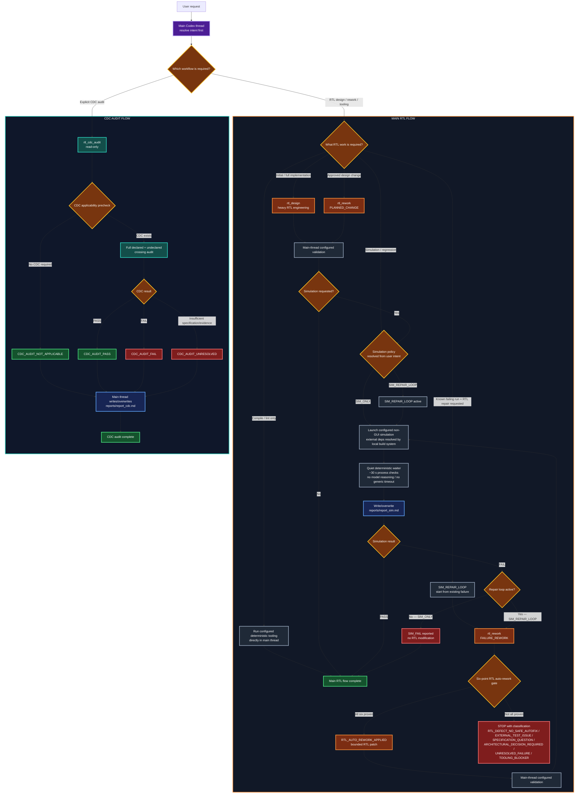

# RTL Agent Architecture — v8

This is a reusable RTL engineering workflow for `rtl_*` repositories.

Project-specific engineering truth remains in:

- `docs/design_guide.md` — authoritative functionality and architecture.
- `docs/rtl_design_guide.md` — authoritative RTL implementation policy.

Generated files under `reports/` are evidence/results only and never override those documents.

The v8 workflow keeps deterministic tooling in the main Codex thread and creates heavy specialist workers only when engineering reasoning is required. It keeps the external verification/VIP implementation opaque to the RTL workflow, preserves the strict low-discovery simulation fast path, and adds a quiet deterministic waiter so long-running simulations do not become repeated model-reasoning loops.

The key v8 simulation rules are intentionally explicit:

```text
"run simulation"
    -> SIM_ONLY
    -> run configured simulation once
    -> report PASS or FAIL
    -> no RTL repair is implied

"run simulation and fix real RTL issues" / "run until RTL is fixed"
    -> SIM_REPAIR_LOOP
    -> run configured simulation
    -> on FAIL, classify with rtl_rework / FAILURE_REWORK
    -> repair only when all six RTL gates pass
    -> validate + rerun
    -> continue with no fixed retry count until PASS or a terminal STOP classification
```

A simulation failure alone never grants permission to modify RTL. Repair permission comes from the user's request, and the six-point gate still determines whether a particular RTL modification is safe.

Long-running simulation supervision is mechanical:

```text
configured simulation command
    -> .agents/tools/rtl_sim_wait.sh
    -> quiet process-liveness check about every 30 seconds
    -> no transcript polling, reasoning, or progress commentary while still running
    -> no generic wall-clock timeout
    -> return to engineering reasoning only after process completion/tool error
```

The 30-second check is only a cheap host-process liveness poll. It is not a testcase timeout, progress heuristic, hang detector, or maximum simulation duration. Legitimate simulations may run for hours or days.

## External verification / VIP boundary

The RTL workflow treats external verification as an **opaque runtime dependency**. The configured RTL CMake/simulation flow is the only interface.

```text
RTL workflow
    |
    v
configured RTL CMake/simulation target
    |
    +--> RTL compile/elaboration
    |
    +--> opaque compiled verification artifact (.so)
    |        resolved/loaded by the configured build system
    |
    v
simulator + RTL-side transcript/waveform evidence
```

Within this workflow, a sibling `vip_*` or other external verification project is **not inspected at all**. Do not list, traverse, search, grep, read, stat, build, configure, or modify its source tree, docs, CMake files, build cache, testcase registration, headers, or generated files.

A request such as `use the current VIP configuration` means: **use whatever external artifact/configuration the RTL repository's existing CMake simulation target is already wired to use**. It does not authorize discovery inside the VIP project.

Runtime messages from the testcase that appear in the local simulator transcript are valid RTL-side evidence. If the external artifact is missing or cannot be loaded, stop from local build/simulator evidence rather than entering the external project to repair it.

## Main workflow



The essential split is:

```text
mechanical execution
    configured init / compile / lint / simulation / rerun
    -> main Codex thread

engineering reasoning
    baseline implementation
    planned RTL change
    failure diagnosis / bounded RTL repair
    explicit CDC audit
    -> appropriate specialist
```

A simulation run by itself is not a reason to create an engineering worker.

## Simulation policies

The main thread resolves the simulation policy from the user's request before the first run.

### `SIM_ONLY`

Use when the user asks to run/simulate/regress and report the result without asking for RTL repair, rework, correction, closure, or repeated fix-and-rerun behavior.

Examples:

```text
Run the RTL simulation using the current VIP configuration and report the result.
Run the regression.
Rerun the current testcase and tell me whether it passes.
```

Behavior:

```text
simulation
  -> PASS: report PASS and stop
  -> FAIL: report FAIL and stop
```

Do not invoke `rtl_rework` merely because `SIM_ONLY` failed. Do not modify RTL.

The words `report the result` do not imply repair permission. An explicit `do not modify RTL` also forces this policy.

#### Simulation execution fast path

Every simulation invocation is intentionally a low-context mechanical path, whether the active policy is `SIM_ONLY` or `SIM_REPAIR_LOOP`:

```text
resolve simulation policy
    -> use already-configured local RTL simulation target
    -> run it through .agents/tools/rtl_sim_wait.sh
    -> remain model-silent while the process is still running
    -> inspect concise local completion/result evidence only after completion
    -> write reports/report_sim.md
    -> PASS: stop
    -> FAIL + SIM_ONLY: report and stop
    -> FAIL + SIM_REPAIR_LOOP: invoke FAILURE_REWORK
```

Do not read the design guides/RTL implementation merely to execute the simulation. Under `SIM_REPAIR_LOOP`, engineering inspection begins only after an actual FAIL requires `FAILURE_REWORK`.

For this path, do **not**:
- perform a full RTL design-document/repository inspection merely to run the simulation;
- recursively inventory the RTL repository when the configured target is already known;
- inspect any sibling verification/VIP project or its source/build/configuration;
- discover testcase names by reading external testcase source;
- dump or ingest a full successful simulator transcript when concise PASS evidence is sufficient;
- repeatedly run broad filesystem or git-status/diff discovery just to prove that RTL was not edited.

If the testcase/plan name is not exposed by the local configured target or simulator output, report it as `unknown` or `current configured plan`; do not cross the verification boundary to discover it.

#### Quiet long-running simulation waiter

Use the included deterministic helper for configured non-GUI simulation/regression execution:

```text
.agents/tools/rtl_sim_wait.sh -- <configured simulation command and arguments>
```

Its default poll interval is approximately 30 seconds. The helper redirects the wrapped command's console output to a temporary log, waits on the child process, and performs silent process-liveness checks. It emits a single compact completion line after the child exits.

While the wrapped process is active:
- do not repeatedly search/read `build/questa/transcript` merely to report testcase progress;
- do not emit `still running`, testcase-number, polling-loop, or similar progress commentary;
- do not infer a hang from transcript silence;
- do not introduce a generic wall-clock timeout or automatically kill a long simulation;
- do not wake engineering reasoning solely because another wait interval elapsed.

If the Codex/tool host nevertheless returns an intermediate `still running`/background-process status, immediately continue waiting on the same process. Do not perform transcript inspection, engineering reasoning, or user-facing progress narration unless there is a concrete tool/execution error or the user explicitly asks for an interim inspection.

The helper has **no maximum wall-clock timeout**. Testcase-functional timeouts remain the verification environment's responsibility. Project-specific hang/watchdog policy may be added outside this generic flow when a project has a meaningful bound, but v8 does not invent one.

After process completion, inspect the configured simulator's final scoreboard/result and only the focused transcript/log evidence required for PASS/FAIL classification. The helper console log is fallback tooling evidence, not the simulation result authority.

### `SIM_REPAIR_LOOP`

Use when the simulation task explicitly asks to fix/rework/correct real RTL failures, or asks for RTL-side closure such as continuing until the RTL issue is resolved. The explicit RTL-repair request itself selects this mode; the user does not also need to spell out `rerun`. Rerunning after every gate-permitted RTL fix is part of this policy.

Examples:

```text
Run the simulation and fix real RTL issues if any are found.
Run simulation; if RTL is wrong, fix it and rerun until resolved.
Keep rerunning after valid RTL fixes until it passes or you hit a real blocker.
```

Behavior:

```text
simulation
  -> PASS: stop
  -> FAIL: rtl_rework / FAILURE_REWORK
       -> RTL_AUTO_REWORK_APPLIED: validate + rerun simulation
       -> terminal classification: stop
```

The loop has **no arbitrary retry limit**. Every new failing run is fresh evidence and requires a fresh six-point-gate decision. A previous RTL fix does not authorize the next one automatically.

The loop must not spin on unchanged state. Never reapply the same patch or repeatedly rerun an unchanged failing state without new evidence. If no further bounded repair can be proven, stop with the appropriate existing terminal classification, normally `UNRESOLVED_FAILURE` or `RTL_DEFECT_NO_SAFE_AUTOFIX` depending on the evidence.

Terminal STOP classifications are:

```text
RTL_DEFECT_NO_SAFE_AUTOFIX
EXTERNAL_TEST_ISSUE
SPECIFICATION_QUESTION
ARCHITECTURAL_DECISION_REQUIRED
UNRESOLVED_FAILURE
TOOLING_BLOCKER
```

A bad testcase/stimulus therefore becomes `EXTERNAL_TEST_ISSUE` and stops. This RTL workflow never inspects or edits the external verification implementation to manufacture PASS; classification is based only on RTL-side runtime/boundary evidence.

## File set

```text
AGENTS.md
.agents/
├── README.md
├── tools/
│   └── rtl_sim_wait.sh
└── skills/
    └── rtl-workflow/
        ├── SKILL.md
        └── references/
            ├── failure-rework.md
            └── report-contracts.md
.codex/
├── config.toml
└── agents/
    ├── rtl_design.toml
    ├── rtl_rework.toml
    └── rtl_cdc_audit.toml
```

Each file has one role:

- `AGENTS.md` — repository-wide RTL rules and workflow authority.
- `.agents/README.md` — architecture overview.
- `.agents/tools/rtl_sim_wait.sh` — quiet deterministic long-simulation wrapper; ~30-second process checks, no generic timeout.
- `SKILL.md` — routing and execution procedure.
- `failure-rework.md` — detailed six-point failure-classification policy.
- `report-contracts.md` — fixed generated-report contracts.
- worker TOMLs — specialist role definitions.
- `.codex/config.toml` — enables specialists and enforces one-at-a-time execution.

## Specialist workers

| Worker | Use | Write authority | Reasoning |
|---|---|---|---|
| `rtl_design` | Initial/full implementation | RTL repository | heavy / xhigh |
| `rtl_rework` | Planned change or failure-driven rework | RTL repository, mode-limited | heavy / xhigh |
| `rtl_cdc_audit` | Explicit independent CDC audit | none; read-only | heavy / xhigh |

RTL editing is single-writer. Never run simultaneous RTL-writing workers.

## Deterministic simulation

There is no `rtl_sim` specialist. The main Codex thread runs only the repository's configured simulation/build targets or an exact user-supplied command. External verification artifacts are consumed only through that configured local flow; the RTL workflow does not inspect the external project behind them.

Configured non-GUI simulation/regression commands are wrapped by `.agents/tools/rtl_sim_wait.sh`. The helper waits mechanically, checks child-process liveness about every 30 seconds without printing progress, and applies no generic wall-clock timeout. The model must not babysit an active simulation by repeatedly reading the transcript or narrating unchanged state.

For every simulation run, resolve intent first and take the mechanical fast path. Read only the minimum local build metadata needed to identify/use the configured target. On completion, inspect concise result evidence rather than expanding the entire transcript. Under `SIM_REPAIR_LOOP`, only an actual FAIL opens the engineering path; failure analysis may then consume the authoritative RTL docs plus focused local transcript/waveform/DUT-boundary evidence, but never external verification-project internals.

After each configured non-GUI simulation it writes/overwrites:

```text
reports/report_sim.md
```

When the verification runner has completed its work, the simulation environment terminates through its established high-level simulation-finish mechanism. Arbitrary delays, timeouts, or force-killing the simulator are not the normal completion design.

## Failure-driven rework

`FAILURE_REWORK` treats `docs/design_guide.md` as fixed authority.

Automatic RTL repair requires all six gates:

1. explicit requirement;
2. correct DUT-boundary stimulus;
3. demonstrated DUT violation;
4. no unresolved interpretation;
5. no specification change required;
6. RTL-only correction.

If all pass, the bounded correction may be applied. In `SIM_REPAIR_LOOP`, the main thread then validates and reruns simulation. Otherwise the loop stops with the appropriate terminal classification.

The detailed policy is in `skills/rtl-workflow/references/failure-rework.md`.

## Planned changes

`PLANNED_CHANGE` is used only when the user explicitly identifies change instructions/documents.

The current `docs/design_guide.md` is baseline and selected instructions are the approved delta. If the delta changes enduring functionality or architecture, reconcile it into `docs/design_guide.md`. Do not widen the change beyond the requested scope.

## CDC audit

The CDC flow remains deliberately independent and explicit-request only.

`rtl_cdc_audit` first checks applicability. A genuinely single-functional-clock design with no asynchronous transfer requiring synchronization returns:

```text
CDC_AUDIT_NOT_APPLICABLE
```

Otherwise it audits every declared crossing and checks for credible undeclared crossings, including:

- source/destination clocks and resets;
- control/payload coherency;
- required versus implemented CDC mechanism;
- request/ack sequencing;
- event persistence and loss/duplication risk;
- reconvergence;
- reset/in-flight behavior;
- asynchronous FIFO/Gray-code correctness where applicable;
- multi-bit sampling safety;
- crossing ownership/direction.

Results:

```text
CDC_AUDIT_PASS
CDC_AUDIT_FAIL
CDC_AUDIT_UNRESOLVED
CDC_AUDIT_NOT_APPLICABLE
```

The worker is read-only. The main thread writes `reports/report_cdc.md`. Any repair is a separate requested rework task.

## Generated reports

Only four fixed latest-result paths exist:

```text
reports/report_design_coverage.md
reports/report_cdc.md
reports/report_rework.md
reports/report_sim.md
```

No timestamped variants. Create a report only when its activity actually runs.

`report_design_coverage.md` is optional and exists only for REQ-enabled designs. The other report contracts are defined in `skills/rtl-workflow/references/report-contracts.md`.

During `SIM_REPAIR_LOOP`, `report_sim.md` and `report_rework.md` are latest-result files and are overwritten on each corresponding iteration.

## REQ-N traceability

REQ-N traceability is optional. When used, IDs are immutable global serial identities and every requirement is mandatory.

Legacy projects without REQ-N identifiers remain valid and do not need `report_design_coverage.md`.

## Copy policy

This workflow is generic. Copy the v8 infrastructure into another `rtl_*` repository without inserting project-specific module names, interfaces, dependencies, or behavior into these files. Those belong in the project's authoritative docs and build scripts.
