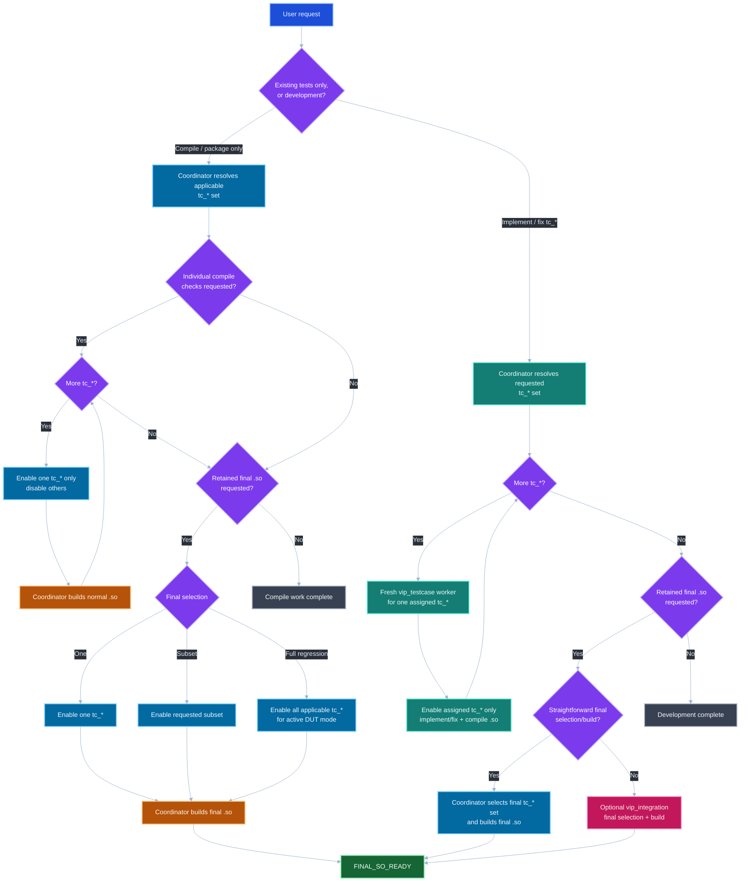

<!--
MIT License

Copyright (c) 2024 Rovshan Rustamov

Permission is hereby granted, free of charge, to any person obtaining a copy
of this software and associated documentation files (the "Software"), to deal
in the Software without restriction, including without limitation the rights
to use, copy, modify, merge, publish, distribute, sublicense, and/or sell
copies of the Software, and to permit persons to whom the Software is
furnished to do so, subject to the following conditions:

The above copyright notice and this permission notice shall be included in all
copies or substantial portions of the Software.

THE SOFTWARE IS PROVIDED "AS IS", WITHOUT WARRANTY OF ANY KIND, EXPRESS OR
IMPLIED, INCLUDING BUT NOT LIMITED TO THE WARRANTIES OF MERCHANTABILITY,
FITNESS FOR A PARTICULAR PURPOSE AND NONINFRINGEMENT. IN NO EVENT SHALL THE
AUTHORS OR COPYRIGHT HOLDERS BE LIABLE FOR ANY CLAIM, DAMAGES OR OTHER
LIABILITY, WHETHER IN AN ACTION OF CONTRACT, TORT OR OTHERWISE, ARISING FROM,
OUT OF OR IN CONNECTION WITH THE SOFTWARE OR THE USE OR OTHER DEALINGS IN THE
SOFTWARE.
-->

# VIP AI Workflow v16

Minimal reusable VIP testcase-development and `.so` build flow.

v16 has a fast mechanical path for already-existing tests and keeps fresh workers only where fresh engineering context actually provides value.

- **COMPILE_ONLY:** coordinator directly selects existing `tc_*` cases and builds the `.so`; zero workers.
- **DEVELOPMENT:** one fresh `vip_testcase` worker per testcase; optional `vip_integration` for the requested retained final `.so`.

There are no coordination services, helper scripts, workflow report files, or simulator actions.

## Main flow

## COMPILE_ONLY fast path

Use this when testcase implementations already exist and the request is mechanical, for example:

- make sure each applicable `tc_*` compiles;
- build a `.so` with one named testcase;
- build a `.so` with a requested subset;
- enable all tests for a DUT mode and build the regression `.so`.

The coordinator does the work directly. It does **not** start `vip_testcase` or `vip_integration`.

For individual checking it repeatedly performs only:

1. enable one `tc_*` for the active mode and disable the others;
2. run the normal project build;
3. verify the `.so` exists;
4. move to the next testcase.

For the retained final artifact it enables exactly the requested final set and builds once more.

If compilation reveals an engineering defect requiring source changes, stop and report it unless the user also requested fixing/development.

## DEVELOPMENT worker path

Use fresh workers only when testcase behavior actually must be implemented or changed.

For `tc_foo`:

1. fresh `vip_testcase` context;
2. same project repository and same normal build directory;
3. enable/uncomment `tc_foo` and disable/comment the other active-mode `tc_*` selections;
4. implement/fix only `tc_foo` and genuinely necessary shared VIP support;
5. compile the normal VIP `.so`;
6. return `TC_READY` and exit.

Workers are strictly sequential. The intermediate `.so` is disposable and the next worker may overwrite it.

If a retained final `.so` is requested after development, one fresh `vip_integration` worker enables exactly the desired final testcase set and builds it.

## Explicit non-goals

This workflow does **not** run simulation and does **not** execute the `.so`. It does not inspect RTL. Its endpoint is a successfully compiled shared library in the project's normal output location.
